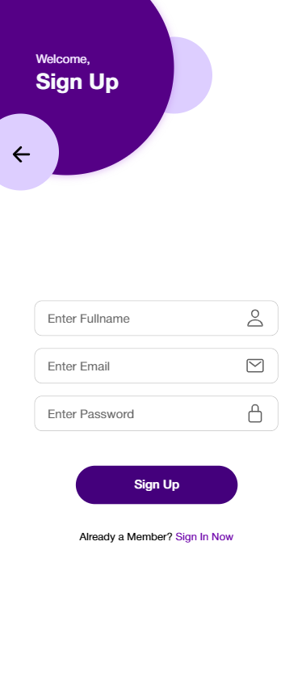
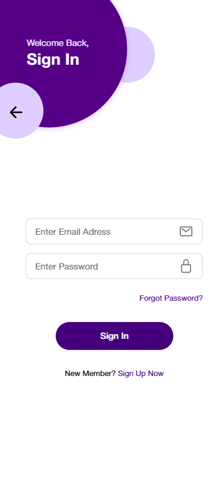
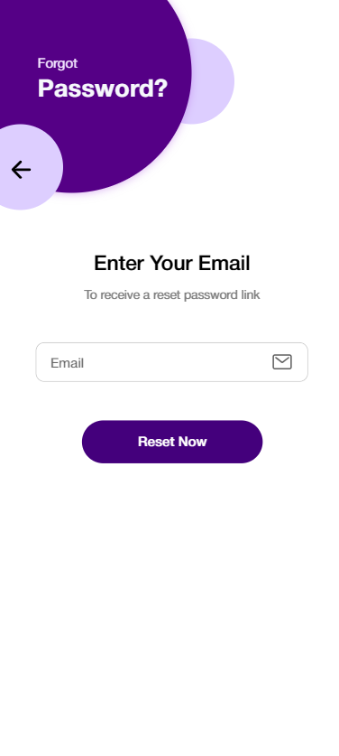
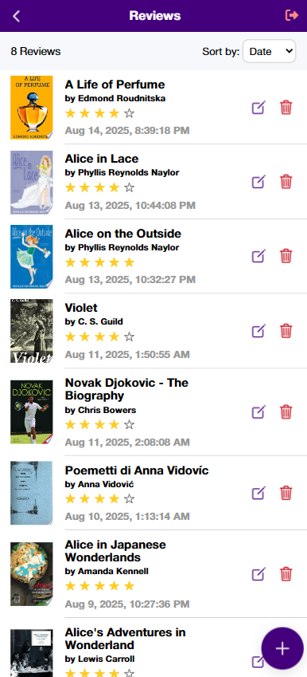
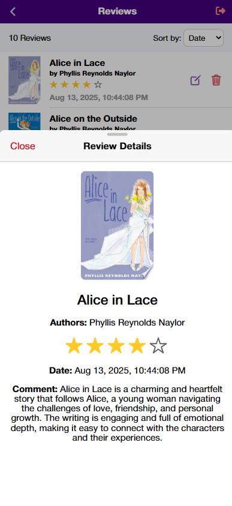

# Books Reviews App

This mobile application allows users to review books and manage their reviews. It is built with **Angular**, **Ionic** and **Firebase**.

## Screenshots

### **Main Screen**

### **Sign Up Screen**

### **Sign In Screen**

### **Change Password Screen**

### **Home Screen**

### **Reviews Screen**

### **Review Details Screen**

### **Search Books Screen**

### **Add Review Screen**

## Features

- User authentication: register, login and reset forgotten passwords.
- Search for books using the Google Books API.
- Add, edit, view and delete book reviews.
- Sort reviews by date or rating.
- Real-time updates using Firebase.

## Integrations

- **Google Books API** — Fetches book information for search and review creation.
- **Firebase Authentication** — Manages user sign-up, login and password reset.
- **Firebase Firestore** — Stores user reviews and provides real-time updates.

## Technologies Used

- **Angular** for building the frontend.
- **Ionic** for mobile-optimized UI components.
- **Firebase** for authentication and database storage.
- Integration with **Google Books API** for book data.

## Installation / How to Run

To run this project locally:

1. Clone the repository:

   #### `git clone https://github.com/AdrianaV1999/books-reviews-app.git`

2. Navigate into the project folder:

   #### `cd books-reviews-app`

3. Install dependencies:

   #### `npm install`

4. Start the development server:

   #### `ionic serve`

This will start the app locally at: `http://localhost:8100`

---

This project demonstrates practical experience with **user authentication, CRUD operations, API integration** and **mobile-friendly development** using Angular, Ionic and Firebase.
